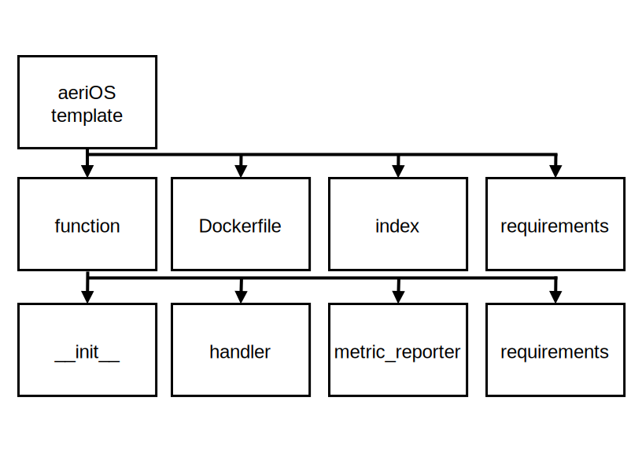

# aeriOS EAT Functions

## aeriOS EAT Functions Template



The aeriOS EAT functions template details the two layers of an [OpenFaaS function template](https://docs.openfaas.com/cli/templates/) for the Python language:

1. The first layer contains information specific to how the function interacts with EAT. This includes the image build file (*Dockerfile*), what libraries Docker needs to compile the function image (*requirements*) and the wrapper used to interface with the function (*index*).
2. The second layer contains information specific to the function operation: 
    - The *\_init_* component contains operations to carry out when the function is deployed. This includes building the Grafana dashboard where in-function metrics will be visualised.
    - The *handler* component contains operations to carry out when the function is triggered, such as a policy or intelligence-based decision making. It typically follows three stages of execution: 1) Data Retrieval, 2) Processing, and 3) Response.
    - The *metric_reporter* component contains operations for exposing in-function metrics to Prometheus. These metrics can then be visualized through the dashboard instantiated when the function was deployed.
    - The *requirements* component contains required libraries for handler executions.

### Available Function Templates
These templates (all are Python-based) are included inside the [template folder](./template/), where each function template is stored inside its own folder. The available templates are the following:
- [aeros-common-deployment](./template/aeros-common-deployment/): Debian + Flask/Waitress, with templating enabled (`template_folder='/home/app/function/embedded_files'`) and `/output` route.
- [aeros-local](./template/aeros-local): Debian + Flask/Waitress, with templating enabled (`template_folder='/home/app/function/embedded_files'`) and `/output` route.
- [aeros-python3-debian](./template/aeros-python3-debian): Debian-based Python image + watchdog, stdin-style function (no Flask). Reads request from stdin and prints response. Exposes port 8080 and uses python3 index.py as fprocess. Adds PyTorch 2.3.1 install in Dockerfile. 
- [aeros-python3-debian-flask](./template/aeros-python3-debian-flask): HTTP handler with `/` and `/generateHTML` routes; `/generateHTML` returns `handler.getHTML()` and renders `Analysis.html`. Includes metric reporting helpers and Grafana dashboard JSON.
- [aeros-python3-debian-host](./template/aeros-python3-debian-host): Debian + Flask/Waitress, HTTP handler with `/` and `/output` routes; uses `template_folder='/home/app/function/embedded_files'` to render HTML via `handler.getOutputName()`. Includes embedded Grafana dashboard JSON.
- [aeros-python3-flask](./template/aeros-python3-flask): Alpine + Flask/Waitress, basic HTTP handler with `/` route only. Standard function skeleton + dashboard JSON + tox config.
- [aeros-python3-flask-host](./template/aeros-python3-flask-host): Alpine + Flask/Waitress, such as *aeros-python3-flask* but adds `/generateHTML` route returning `handler.getHTML()`. No embedded template folder.
- [aeros-python3-flask-pytorch-build](./template/aeros-python3-flask-pytorch-build): Alpine + Flask/Waitress, adds PyTorch 1.4.0 install in Dockerfile. Otherwise same structure as *aeros-python3-flask*.
- [aeros-python3-flask-scikit-learn-build](./template/aeros-python3-flask-scikit-learn-build): Alpine + Flask/Waitress, adds build tools for scikit-learn in Dockerfile. Otherwise same structure as *aeros-python3-flask*.

The *host* templates are the ones that expose extra HTTP endpoints for serving HTML/UI output rather than just returning the handler's raw result.


## EAT Functions Management and Use

**The aeriOS function template must be used to create EAT functions, this process is handled through the *faas-cli* application.**


The steps involved from the creation to the deployment of EAT functions is shown in the figure above. The [faas-cli application](https://github.com/openfaas/faas-cli) (a CLI for OpenFaaS) allows users to **create** EAT functions using the aeriOS template. The application also enables the build, push, and deployment of functions to EAT.
- **Build** packages the EAT function as a Docker image and stores the image locally.
- **Push** allows the user to specify a container registry to store the image.
- **Deploy** takes an image, either locally or from a container registry and onboards the image as a node in the Kubernetes cluster.

This allows users to dynamically deploy and update functions as versioning can be controlled at deployment. 

Interfaces between EAT and other aeriOS components can be viewed on two levels:
1. The first level is the interface provided by EAT for the function i.e. REST, this interface is triggered through a HTTP request which provides a body that is passed into the function handler.
2. The second level is interfaces established inside the function, such as queries to other aeriOS components (e.g. NGSI-LD Context Broker or HLO) or pushing metrics to Prometheus.

Both interfaces are available to users, however the execution of a function will always require a HTTP request to trigger, and also a response to signify the execution has concluded.

<!-- The installation of EAT comes with three prepackaged functions, these functions provide generalised stratified sampling, anomaly detection and data drift detection based on Data Fabric models. These functions may require minor edits on an ad hoc basis, depending on the complexity of data models being used.   -->

### faas-cli Application
The *faas-cli* application is required to create, build and deploy functions from CLI.
The [get-fass-cli.sh script](./get-faas-cli.sh) will download *faas-cli* version 0.16.7 which has been used throughout EAT development.
Depending on your machine you may need to add permissions or move the downloaded *faas-cli* binary to a different directory for it to become executable.

```sh
chmod +x get-faas-cli.sh
./get-faas-cli.sh
```

### Function Creation
To create an aeriOS function for the Embedded Analytics Tool, you must create it from the aeriOS function template.
The following function uses the faas-cli application to create a new function called *stratified-sampling*.
The *--lang* parameter specifies our aeriOS template.
The *--prefix* parameter specifies an image registry to push and pull the image from.

```sh
faas-cli new example-function --lang aeros-python3-flask --prefix docker.io/eclipseaerios
```

However if you wish to use *scikit-learn* libraries a unique template is required as shown here:

```sh
faas-cli new example-function --lang aeros-python3-flask-scikit-learn-build --prefix your-registry.org
```

### Use functions from a private container registry
To ensure your functions can be pulled from a private container registry, you must modify the function YML file to include the registrypull secret, see below:

```yml
version: 1.0
provider:
  name: openfaas
  gateway: http://127.0.0.1:8080
functions:
  stratified-sampling:
    lang: aeros-python3-flask
    handler: ./stratified-sampling
    image: my-private-registry.org/eat-stratified-sampling:latest
    secrets:
      - <registry-pull-secret>
```

### Function Deployment

*faas-cli* provides an *up* operation which couples the building, pushing and deployment of a new function.
To deploy our function to the Embedded Analytics Tool, this operation should be used as it ensures all versions of your function, local/registry/deployed, are the same.

```sh
faas-cli up -f example-function.yml -e GRAFANA_USER=$GRAFANA_USER -e GRAFANA_PASS=$GRAFANA_PASS
```

## EAT Functions Developed In aeriOS
A set of EAT functions have been already developed in aeriOS using the aeriOS function templates. 

These functions are available inside this [functions folder](./). Each function is composed of 1) Function definition in YAML and 2) Function code (stored inside its own folder). For instance, for the *hlo-explainer* function is defined in the [hlo-explainer.yml file](./hlo-explainer.yml) and its code is included inside the [hlo-explainer folder](./hlo-explainer/).

The following functions are available in aeriOS:
- **anomaly-detection**: uses a similar data retrieval process to the one used in *stratified-sampling*, but applies different logic to identify outliers in the data sample. This function can be enhanced through training to better suit specific use cases.
- **data-drift**: involves a more complex data retrieval process, as it compares current data to historical data to detect variance over time. Depending on the type of drift, some algorithms are better suited to identifying this variance. Our approach uses a distribution-based algorithm to highlight data drift between historical and current data.
- **ec001**: function related with the error code 001 of the [aeriOS Self-orchestrator](https://github.com/eclipse-aerios/self-orchestrator).
- **eda-report**: function that performs exploratory data analysis (EDA) from the data of a 5G IoT vehicle.
- **edaalt**: function that performs exploratory data analysis (EDA) from the data of a 5G IoT vehicle.
- **hlo-explainer**: [HLO AI explainability service](https://github.com/eclipse-aerios/hlo-explainability-service) with a dashboard to display the XAI results of the HLO AI algorithm.
- **hlo-visualization**: function based on Kalman filter.
- **onos-for-eat**: function for the Open Network Operating System.
- **stratified-sampling**: flexible function that generates a data sample based on parameters specified by the user. These parameters include filters for data retrieval and an option to produce either a proportional or disproportional sample.

## Common Issues
Below are common issues faced when working with functions accompanied by fixes:

### Docker login
If an unauthorised exception is triggered it may be related to Docker login.
This can be fixed by logging into the container registry.

```sh
docker login your-private-registry.org -u $USERNAME -p $PRIVATE_TOKEN
```

### Crashed Functions
If your function crashes after deployment you can check function logs:

```sh
kubectl logs example-function-564b5cd49-cx22k --namespace openfaas-fn
```

### Grafana Dashboards
If you have exported your dashboard from Grafana and are receiving a bad request error from REST POST this is often because your id fields are not set to null, Grafana API will assign these ids when processing the call.

### Depolying Functions through Helm
If you wish to package your functions with the EAT installation or deploy functions through an orchestrator/policy instuctions can be found [on the OpenFaaS website](https://www.openfaas.com/blog/howto-package-functions-with-helm/)

## License
The Eclipse aeriOS EAT functions are licensed under the MIT License.
